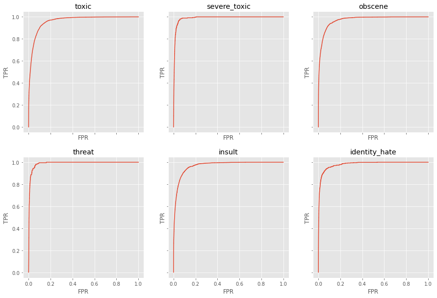
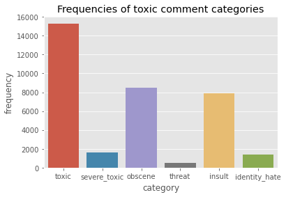

# Classify toxic comments with NLP techniques

This project addresses the toxic comment classification problem for the Kaggle [Toxic Comment Classification Challenge](https://www.kaggle.com/c/jigsaw-toxic-comment-classification-challenge). The jupyter notebook content includes data preprocessing, data exploration, modeling and evaluation.

## Motivation

Due to the huge amount of data in social networks, it is impossible to manually remove all toxic comments which lead to the necessity of automatic toxic comment detection by using computer-based algorithms. However, the processing and understanding of natural language by machines is a complex task. The subfield Natural Language Processing (NLP) deals with various techniques and methods for solving this problem. For toxic comment detection, several methods for text classification can be used such as classical machine learning or advanced deep learning techniques. A high accuracy of toxic comment classification can therefore automatize the detection and filtering of undesired text documents.

## Results

Throughout this project, two different nlp approaches were applied and compared which include a simple multioutput logistic regression model and recurrent neural network with gated recurrent units (GRU). Furthermore, several experiments with different architectures have been performed which included simple GRU's, LSTM's, Bidirectional RNN's and a combination of RNN and CNN. However, the experiments have shown no relevant performance differences among the various neural network architectures. Hence, only the GRU network was used for the toxic comment classification task.

The logistic regression model hyperparameters were identified by applying gridsearch in a 5-fold cross-validaton fashion by using tf-idf vectorizing for the input features and the accuracy as scoring function. As a result, the multioutput logistic regression classifier returned the best results with the following hyperparameters:
- *C = 1*
- *penalty = l1*
- *solver = saga*

The GRU network outperformed the logistic regression model especially in the metric accuracy with the following results:
- Logistic Regression: 88.62 % (Accuracy), 97.26 % (AUC)
- **GRU: 96.33 % (Accuracy), 97.70 % (AUC)**

The following image shows the ROC curves for each toxic comment label using the GRU model.

## Data

The dataset is published by the Conversation AI team founded by Jigsaw and Google who study negative online behaviors, like toxic comments. Therefore, they introduced the Toxic Comment Classification Challenge on Kaggle to improve the performance of toxic comment detection. The data used consists of a train and test set with 159,571 and 63,978 observations (after removing missing labels), respectively. The features include the id, comment and several labels for classifying the comments into different types of toxicity.

The class distribution of the train set is shown in the following bar chart. **Note**: One observation may have multiple labels as it represents a multi-label classification task.

